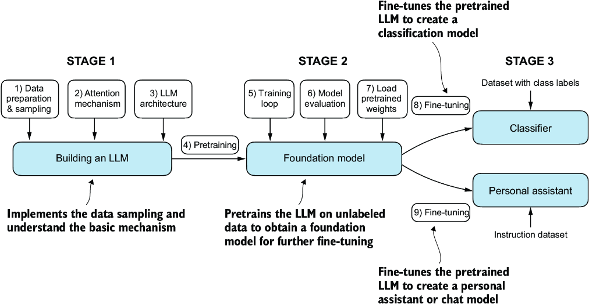

# LLM From Scratch Book Repo
**I am using here just to keep my work on the cloud. Most of the information and codes are taken from Sebastian Raschka's LLM from Scratch book.**

**Here is the outline of the repo:**

## Bonus
Here is a [YouTube Channel](https://youtube.com/@newmachina?si=4d19oDaCwyVUngYF) that I find useful to learn new methods, terminology, and also some applications.
Videos are generally around 5 minutes long which makes it easy to comprehend.