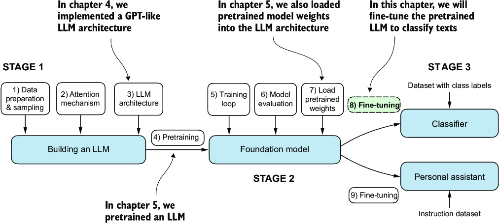

# Chapter 6: Fine-tuning for Classification
In this chapter, we will step into fine-tuning and different approaches.
2 main approaches are **classification fine-tuning** and **instruction fine-tuning.**
In this chapter specifically, we will design end-to-end classification fine-tuning notebook. Hope you enjoy it!

---
### Topics are as follow:
- Different categories of fine-tuning
- Preparing the **dataset**
- Creating **data loaders**
- Initializing a **model with pretrained weights**
- Adding a **classification head**. (Important information here is after adding the classification head, do not need to freeze the other part of the pretrained model meaning that we make all layers nontrainable.)
- Calculating the classification **loss** and accuracy
- **Fine-tuning the model** on supervised data
- **Using the LLM** as a spam classifier

### Summary
- There are different strategies for fine-tuning LLMs, including classification fine-tuning and instruction fine-tuning.
- Classification fine-tuning involves replacing the output layer of an LLM via a small classification layer.
- In the case of classifying text messages as "spam" or "not spam", the new classification layer consists of only 2 output nodes. Previously we used the number of output nodes equal to the number of unique tokens in the vocabulary.
- Instead of predicting the next token in the text as in pretraining, classification fine-tuning trains the model to output a correct class label -for example "spam" or "not spam".
- The model input for fine-tuning is text converted into token IDs similar to pretraining.
- Before fine-tuning an LLM, we load the pretrained model as a base model.
- Evaluating a classification model involves calculating the classification accuracy (the fraction or percentage of correct predictions).
- Fine-tuning a classification model uses the same cross-entropy loss function as when pretraining the LLM.